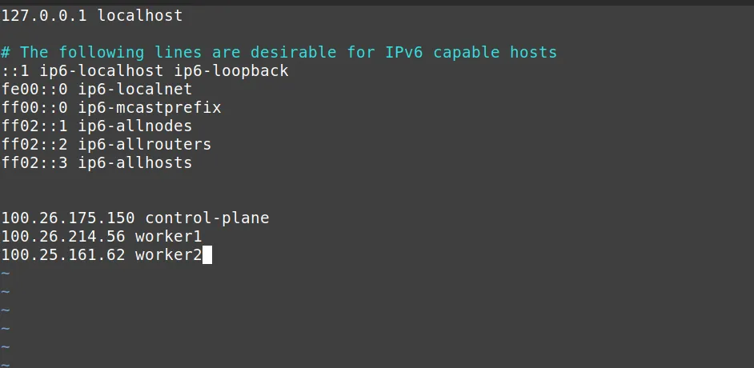

# **Kubernetes Cluster no AWS EC2**

Esta prática foi elaborada como um exercício da disciplina [Computação em Nuvem](https://github.com/glaucogoncalves/cc) ofertada no ãmbito do PPGEE/UFPA.

A atividade trabalha a configuração e implantação de um cluster Kubernetes na AWS usando instâncias EC2, bem como a implantação de uma aplicação PHP/MySQL, como exemplo. A configuração envolve a criação da infraestrutura na AWS, instalação do Kubernetes e a implantação da aplicação.

## **Sumário**

- [**Kubernetes Cluster com PHP/MySQL no AWS EC2**](#kubernetes-cluster-com-phpmysql-no-aws-ec2)
  - [Para informações mais detalhadas, acesse o documento da aula](#para-informações-mais-detalhadas-acesse-o-documento-da-aula)
  - [**Sumário**](#sumário)
  - [**Pré-requisitos**](#pré-requisitos)
  - [**1. Criando e Configurando a Infraestrutura no AWS**](#1-criando-e-configurando-a-infraestrutura-no-aws)
    - [1.1 Criando uma VPC](#11-criando-uma-vpc-personalizada)
    - [1.2 Criando Grupos de Segurança](#12-criando-grupos-de-segurança)
    - [1.3 Criando Instâncias EC2](#13-criando-instâncias-ec2)
    - [1.4 Conectando-se via SSH](#14-conectando-se-via-ssh)
  - [**2. Instalando o Kubernetes**](#2-instalando-o-kubernetes)
    - [2.1 Instalando containerd](#21-instalando-containerd)
    - [Opcional](#opcional)
    - [2.2 Inicializando o Cluster Kubernetes no Control Plane](#22-inicializando-o-cluster-kubernetes-no-control-plane)
    - [2.3 Conectando os Workers ao Cluster](#23-conectando-os-workers-ao-cluster)
  - [**3. Implantando o MySQL e a Aplicação PHP**](#3-implantando-o-mysql-e-a-aplicação-php)
    - [3.1 Implantação do MySQL](#31-implantação-do-mysql)
    - [3.2 Implantação da Aplicação PHP](#32-implantação-da-aplicação-php)
  - [**4. Acessando a Aplicação**](#4-acessando-a-aplicação)
  - [**5. Troubleshooting**](#5-troubleshooting)
  - [5.1 Pod em estado Pending](#51-pod-em-estado-pending)
    - [5.2 Erro de Conexão ao MySQL](#52-erro-de-conexão-ao-mysql)
---

## **Pré-requisitos**

- Conta AWS ativa.
- **Chave PEM** (arquivo `.pem`) gerada durante a criação das instâncias EC2.
- Familiaridade com SSH e comandos de shell no linux.

---

## **1. Criando e Configurando a Infraestrutura no AWS**


### 1.1 Criando uma VPC Personalizada

Nesta etapa, criaremos uma VPC (Virtual Private Cloud) personalizada para isolar nossa infraestrutura e ter um melhor controle sobre a rede.

1. Acesse o **Console AWS**.
2. Vá para **VPC > Your VPCs**.
3. Clique em **Create VPC**.
4. Defina os seguintes parâmetros:
   - **Name tag**: `KubernetesVPC`
   - **IPv4 CIDR block**: `10.0.0.0/16`
   - **Tenancy**: `Default`
5. Clique em **Create**.

#### Criando Sub-redes:

1. Vá para **Subnets** e clique em **Create subnet**.
2. Crie duas sub-redes em diferentes zonas de disponibilidade:

   - **Subnet 1**:
     - **Name tag**: `PublicSubnet1`
     - **VPC**: Selecione `KubernetesVPC`
     - **Availability Zone**: Escolha uma zona (por exemplo, `us-east-1a`)
     - **IPv4 CIDR block**: `10.0.1.0/24`
   
   - **Subnet 2**:
     - **Name tag**: `PublicSubnet2`
     - **VPC**: Selecione `KubernetesVPC`
     - **Availability Zone**: Escolha uma outra zona (por exemplo, `us-east-1b`)
     - **IPv4 CIDR block**: `10.0.2.0/24`

3. Clique em **Create subnet**.

#### Criando um Internet Gateway:

1. Vá para **Internet Gateways** e clique em **Create internet gateway**.
2. Defina os seguintes parâmetros:
   - **Name tag**: `KubernetesIGW`
3. Clique em **Create internet gateway**.
4. Após a criação, selecione o **Internet Gateway** e clique em **Actions > Attach to VPC**.
5. Selecione a **KubernetesVPC** e clique em **Attach internet gateway**.

#### Configurando a Tabela de Rotas:

1. Vá para **Route Tables**.
2. Selecione a tabela de rotas automaticamente criada para sua VPC.
3. Clique em **Routes > Edit routes**.
4. Adicione uma nova rota:
   - **Destination**: `0.0.0.0/0`
   - **Target**: Selecione o **KubernetesIGW** (Internet Gateway criado).
5. Salve as alterações.

#### Associando as Sub-redes à Tabela de Rotas:

1. Clique em **Subnet Associations > Edit subnet associations**.
2. Marque as sub-redes **PublicSubnet1** e **PublicSubnet2**.
3. Salve as alterações.

### 1.2 Criando Grupos de Segurança

Nesta primeira etapa criaremos duas Virtual Private Cloud (VPC) na AWS, as quais permitirão a criação de uma rede isolada entre as intâncias que criaremos posteriormente.

1. **Acesse o Console AWS** e vá para **VPC > Security Groups**.
2. **Crie dois grupos de segurança e configure as inbound rules**:
   - **Control Plane Security Group**:
     - SSH (porta 22): `0.0.0.0/0`
     - TCP (porta 6443): `0.0.0.0/0`
     - TCP (portas 2379-2380, 10250-10259): CIDR da VPC
   - **Worker Security Group**:
     - SSH (porta 22): `0.0.0.0/0`
     - TCP (porta 10250): CIDR da VPC
     - TCP (portas 30000-32767): `0.0.0.0/0`
3. **Defina a outbound rule tanto na vpc do control plane quanto na worker**:
   - All traffic `0.0.0.0/0`

### 1.3 Criando Instâncias EC2

1. **Crie 3 instâncias EC2**: 1 Control Plane e 2 Workers.
   - Control Plane: `t2.medium` (Ubuntu 22.04).
   - Workers: `t2.large` (Ubuntu 22.04).
2. **Anexe o grupo de segurança apropriado** para cada instância.
3. **Gere ou selecione uma chave SSH** para acessar as instâncias.

### 1.4 Conectando-se via SSH

Certifique-se de que as permissões da chave .pem estão configuradas corretamente:

```bash
chmod 400 /caminho/para/sua-chave.pem
```

Para conectar-se a uma instância EC2 via SSH:

```bash
ssh -i /caminho/para/sua-chave.pem ubuntu@<IP-PUBLICO-DA-EC2>
```

## **2. Instalando o Kubernetes**

### 2.1 Preparando o ambiente
Adicione o mapeamento de IP ao nome do host no arquivo de hosts de todos os três nós, e faça isso em todas as 3 máquinas

```bash 
sudo vim /etc/hosts
``` 


No terminal, substituiremos o ip por um nome de host amigável. Execute o comando a seguir, mas substitua control-plane por worker1 e worker2 , ao executar em terminais respectivos.

```bash
$ sudo hostnamectl set-hostname control-plane
$ sudo hostnamectl set-hostname worker1
$ sudo hostnamectl set-hostname worker2
```

Desconecte-se do SSH e conecte-se novamente para que os novos nomes apareçam.

Execute os seguintes comandos em todas as instâncias EC2 (Control Plane e Workers):

```bash
sudo swapoff -a
sudo apt update
```
### 2.2 Instalando o containerd
Usaremos os scripts `containerd-install.sh` e `k8s-install.sh`, que estão neste repositório. Siga as instruções a seguir.

```bash
vim ./containerd-install.sh
``` 
Torne o arquivo executavel
```bash
chmod u+x ./containerd-install.sh
```
Execute e depois cheque os status, deve estar "activate"
```bash
service containerd status
``` 

repita este processo para o kubernetes
```bash
vim ./k8s-install.ssh
``` 

```bash
chmod u+x ./k8s-install.sh
```

```bash
service kubelet status
``` 

### 2.2 Inicializando o Cluster Kubernetes no Control Plane

No Control Plane, inicialize o cluster Kubernetes:

```bash
sudo kubeadm init --pod-network-cidr=10.244.0.0/16
```
Configure o kubectl:

```bash

mkdir -p $HOME/.kube
sudo cp -i /etc/kubernetes/admin.conf $HOME/.kube/config
sudo chown $(id -u):$(id -g) $HOME/.kube/config
```
### 2.3 Conectando os Workers ao Cluster

No Control Plane, gere o comando kubeadm join:

```bash
kubeadm token create --print-join-command
```
Execute esse comando nos Workers para conectá-los ao cluster.
## **3. Implantando o MySQL e a Aplicação PHP**
### 3.1 Implantação do MySQL

Crie o arquivo mysql-deployment.yaml:

```yaml
apiVersion: v1
kind: PersistentVolumeClaim
metadata:
  name: mysql-pv-claim
spec:
  accessModes:
    - ReadWriteOnce
  resources:
    requests:
      storage: 1Gi
---
apiVersion: v1
kind: Service
metadata:
  name: mysql-service
spec:
  ports:
    - port: 3306
  selector:
    app: mysql
---
apiVersion: apps/v1
kind: Deployment
metadata:
  name: mysql-deployment
spec:
  selector:
    matchLabels:
      app: mysql
  template:
    metadata:
      labels:
        app: mysql
    spec:
      containers:
      - image: mysql:5.7
        name: mysql
        env:
        - name: MYSQL_ROOT_PASSWORD
          value: "password"
        - name: MYSQL_DATABASE
          value: "todo"
        ports:
        - containerPort: 3306
        volumeMounts:
        - name: mysql-persistent-storage
          mountPath: /var/lib/mysql
      volumes:
      - name: mysql-persistent-storage
        persistentVolumeClaim:
          claimName: mysql-pv-claim
```
Implante o MySQL:

```bash
kubectl apply -f mysql-deployment.yaml
```
### 3.2 Implantação da Aplicação PHP

Crie o arquivo php-deployment.yaml:

```yaml
apiVersion: v1
kind: Service
metadata:
  name: php-service
spec:
  type: NodePort
  ports:
    - port: 80
      targetPort: 80
      nodePort: 30589
  selector:
    app: php
---
apiVersion: apps/v1
kind: Deployment
metadata:
  name: php-deployment
spec:
  replicas: 1
  selector:
    matchLabels:
      app: php
  template:
    metadata:
      labels:
        app: php
    spec:
      containers:
      - image: lucasmatni01/php-todo:latest
        name: php
        ports:
        - containerPort: 80
        env:
        - name: MYSQL_HOST
          value: "mysql-service"
        - name: MYSQL_USER
          value: "root"
        - name: MYSQL_PASSWORD
          value: "password"
        - name: MYSQL_DATABASE
          value: "todo"
```
Implante a aplicação PHP:

```bash
kubectl apply -f php-deployment.yaml
```
## **4. Acessando a Aplicação**

    Obtenha o IP público da sua instância EC2 (Worker).
    No navegador, acesse a aplicação via NodePort:

``` vbnet

http://<IP-PUBLICO-DO-WORKER>:30589
```

## **5. Troubleshooting**
## 5.1 Pod em estado Pending

    Causa: Pode ser um problema com volumes persistentes ou falta de recursos no nó.
    Solução: Verifique o status do pod com:

```bash
kubectl describe pod <nome-do-pod>
```

### 5.2 Erro de Conexão ao MySQL

    Solução: Verifique se o MySQL está rodando e se as credenciais estão corretas.
